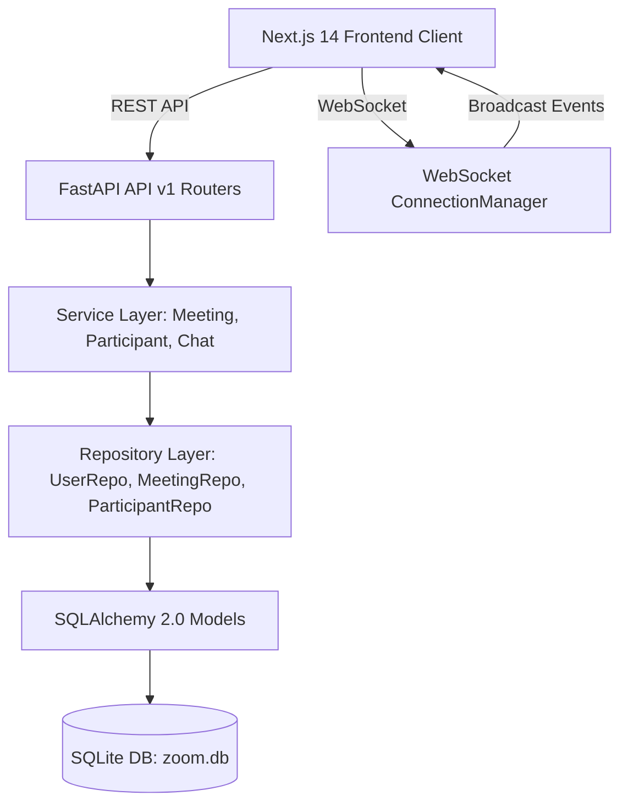

# Zoom Web App Clone ("Zoom Clone")

A pixel-close, full-stack Zoom web application clone built for an SDE Full-Stack evaluation. Featuring Next.js 14 (App Router, TypeScript, Tailwind CSS), FastAPI, SQLAlchemy 2.0 ORM, SQLite with foreign key enforcement, real-time WebSocket presence, in-meeting chat, host controls, and WebRTC video conferencing.

---

## 📸 Overview & Features

- **Pixel-Close Zoom Design Tokens**:
  - Zoom Primary Blue (`#0B5CFF`), Hover (`#0845BF`)
  - Zoom Orange (`#FF742E`) for New Meeting
  - In-meeting dark background (`#1C1C1C`) with control bar (`#232323`)
  - Typography in Lato, 8px grid spacing, 8px card radius, and custom scrollbars.
- **Home Dashboard**:
  - 4 Zoom Action Tiles: **New Meeting** (with video on/off dropdown), **Join** (with modal parsing IDs and URLs), **Schedule**, **Share Screen**.
  - Right-side live ticking clock card with next upcoming meeting preview and instant start button.
  - Tabs for **Upcoming** and **Recent / Previous** meetings populated from seeded data.
- **Meetings Portal (`/meetings`)**:
  - Sub-navigation tabs: **Upcoming**, **Previous**, **Attachments**, **Personal Room**, **Meeting Templates**.
  - Personal Meeting Room view with permanent PMI (`382 914 8201`), passcode, invite link, and instant start.
  - Zoom welcome banner with "Schedule a Meeting" action.
- **Schedule Meeting (`/meetings/schedule`)**:
  - Topic, Description, Date picker, Time picker, Duration (Hours/Minutes), Timezone selector.
  - Security toggles: Passcode generation & Waiting room.
  - Video defaults: Host video & Participant video switches.
  - Auto-validation: Ensures start time is in the future and duration > 0.
- **Meeting Detail (`/meetings/[id]`)**:
  - Meeting overview, passcode, formatted meeting ID, invite link.
  - "Start this Meeting", "Copy Invitation" (with formatted text modal), and "Cancel Meeting".
- **Join Meeting by Link (`/join/[code]`)**:
  - Resolves meeting code from URL, prompts for display name and passcode, allows setting "Don't connect to audio" and "Turn off my video".
  - Live backend validation: returns `404` for invalid codes and `410 Gone` for ended meetings.
- **In-Meeting Room (`/meeting/[code]`)**:
  - **Pre-Join Screen**: Live camera preview via `getUserMedia`, mic/camera toggle buttons, name confirmation.
  - **Main Stage**: Dynamic responsive video grid (single speaker, 2-split, 2x2, 3x3), Speaker View vs Gallery View toggle, speaking indicator border.
  - **Top Bar**: Encrypted shield badge, popover with meeting ID, passcode, copy link, and elapsed timer.
  - **Bottom Control Bar**: Mute/Unmute, Start/Stop Video, Participants counter, Chat counter, Screen Share (`getDisplayMedia`), Reactions (👏, 👍, ❤️, 😂, 😮, 🎉), Raise Hand, and red End/Leave button with confirmation popover.
  - **Participants Side Drawer**: Active roster, search filter, mute/video states, hand raise badges, and host controls (**Mute All**, individual Mute, and **Remove Participant**).
  - **In-Meeting Chat Drawer**: Real-time message broadcast with sender badges and timestamps.
  - **WebSocket Signaling & Presence**: Instant join/leave presence, host mute notifications, and WebRTC peer negotiation.

---

## 🛠️ Tech Stack

| Layer | Technology |
|---|---|
| **Frontend** | Next.js 14+ (App Router), React 18, TypeScript (Strict Mode), Tailwind CSS, Lucide Icons |
| **Backend** | Python 3.11+, FastAPI, SQLAlchemy 2.0 ORM, Pydantic v2, Uvicorn |
| **Database** | SQLite (`zoom.db`) with `PRAGMA foreign_keys = ON` |
| **Real-time** | FastAPI WebSockets (`/ws/meeting/{code}`), WebRTC Mesh (STUN servers) |
| **Testing** | Pytest, Pytest-Asyncio, HTTPX TestClient |

---

## 🏗️ Architecture & Layering

The codebase strictly adheres to the clean separation:
$$\text{Routes} \longrightarrow \text{Services} \longrightarrow \text{Repositories} \longrightarrow \text{Models}$$

- **No business logic in route handlers**: All validation, session state transitions, and authorization live in `services/`.
- **No raw DB queries in services**: All database interactions are encapsulated in `repositories/`.
- **No fetch calls in UI components**: All API communication flows through `lib/api.ts` and custom hooks (`useMeetings`, `useLocalMedia`, `useMeetingSocket`).



---

## 📊 Database Schema & ERD

```mermaid
erDiagram
    USERS ||--o{ MEETINGS : hosts
    USERS ||--o{ PARTICIPANTS : joins
    MEETINGS ||--o{ PARTICIPANTS : contains
    MEETINGS ||--o{ CHAT_MESSAGES : holds
    PARTICIPANTS ||--o{ CHAT_MESSAGES : sends

    USERS {
        int id PK
        string name
        string email UK
        string avatar_url
        string personal_meeting_id UK
        string timezone
        datetime created_at
    }

    MEETINGS {
        int id PK
        string meeting_code UK,IX
        string title
        text description
        int host_id FK
        string type
        string status IX
        datetime scheduled_start
        int duration_minutes
        string timezone
        string passcode
        boolean waiting_room
        boolean host_video_default
        boolean participant_video_default
        datetime started_at
        datetime ended_at
        datetime created_at
        datetime updated_at
    }

    PARTICIPANTS {
        int id PK
        int meeting_id FK,IX
        int user_id FK
        string display_name
        string role
        boolean is_muted
        boolean is_video_off
        boolean is_hand_raised
        boolean is_removed
        datetime joined_at
        datetime left_at IX
    }

    CHAT_MESSAGES {
        int id PK
        int meeting_id FK,IX
        int participant_id FK
        text content
        datetime created_at
    }
```

### Schema Design Decisions & Rationales

1. **Meeting Code stored separately from Primary Key (`id`)**:
   - *Rationale*: Meeting codes are randomized 10-digit numbers (`123 4567 8901`) exposed to end-users and invite links. Keeping an internal auto-increment integer PK ensures high-performance foreign key index lookups while decoupling user-facing identifiers from internal row IDs.
2. **`status` Enum vs. Datetimes**:
   - *Rationale*: A discrete `status` column (`scheduled`, `live`, `ended`, `cancelled`) enables immediate indexing (`ix_meetings_status`) and avoids expensive dynamic date calculations in dashboard filter queries, while `started_at` and `ended_at` preserve exact audit logs.
3. **Participants as per-session rows**:
   - *Rationale*: Creating a new row for each join session allows accurate attendance tracking, timestamps for when a user joined and left (`left_at`), multiple rejoins by the same user, and support for guest participants without an existing user account (`user_id` is nullable).
4. **Index on `(meeting_id, left_at)`**:
   - *Rationale*: Provides $O(1)$ lookup for active participants (`left_at IS NULL AND is_removed IS FALSE`) to render participant rosters and counts instantly.
5. **SQLite `PRAGMA foreign_keys = ON`**:
   - *Rationale*: Enforced via SQLAlchemy engine connection event listener to ensure relational integrity on cascades and joins.

---

## 🚀 Setup & Running Instructions

### Prerequisites
- Python 3.11+
- Node.js 18+ & npm

### 1. Backend Setup
```bash
cd backend

# Create and activate virtual environment
python -m venv .venv

# On Windows:
.\.venv\Scripts\activate
# On Linux/macOS:
source .venv/bin/activate

# Install dependencies
pip install -r requirements.txt

# Seed the database (automatic on first run, or run manually)
python -m app.db.seed

# Start FastAPI development server
uvicorn app.main:app --reload --host 0.0.0.0 --port 8000
```
Backend runs at: `http://localhost:8000`  
API Swagger Docs: `http://localhost:8000/docs`

### 2. Frontend Setup
```bash
cd frontend

# Install npm dependencies
npm install

# Start Next.js development server
npm run dev
```
Frontend runs at: `http://localhost:3000`

---

## 🧪 Testing Backend (Pytest)

Run the backend test suite:
```bash
cd backend
.\.venv\Scripts\python -m pytest -v
```
All tests verify:
- Meeting code generation, formatting (`123 4567 8901`), and URL parsing
- User retrieval (`/api/v1/users/me`)
- Upcoming and recent meeting filters
- Instant meeting creation and validation
- Scheduled meeting validation (future start and duration check)
- Participant join, roster query, leave, and end meeting lifecycle
- Status `404 Not Found` and `410 Gone` error responses

---

## 📡 API Summary (`/api/v1`)

| Method | Endpoint | Description |
|---|---|---|
| `GET` | `/health` | Application health check (`{"status": "ok"}`) |
| `GET` | `/api/v1/users/me` | Fetch authenticated host user (Vinayak) |
| `POST` | `/api/v1/meetings/instant` | Create instant meeting (`status=live`), returns host participant & invite link |
| `POST` | `/api/v1/meetings/schedule` | Schedule future meeting with validation on start date and duration |
| `GET` | `/api/v1/meetings?filter=upcoming\|recent\|all` | Filter meetings (upcoming: scheduled/live; recent: ended) |
| `GET` | `/api/v1/meetings/{id}` | Get meeting details by ID |
| `PATCH` | `/api/v1/meetings/{id}` | Update meeting settings |
| `DELETE` | `/api/v1/meetings/{id}` | Cancel scheduled meeting |
| `GET` | `/api/v1/meetings/code/{code}/validate` | Validate code: returns 200, 404 (not found), or 410 (ended) |
| `POST` | `/api/v1/meetings/code/{code}/join` | Join meeting session, returns participant & meeting info |
| `POST` | `/api/v1/meetings/code/{code}/leave?participant_id={id}` | Mark participant as left |
| `POST` | `/api/v1/meetings/code/{code}/end` | End meeting for all participants (host only) |
| `GET` | `/api/v1/meetings/code/{code}/participants` | Get active participants in the meeting |
| `POST` | `/api/v1/meetings/code/{code}/mute-all` | Host control: mute all participants except host |
| `POST` | `/api/v1/participants/{id}/mute?is_muted={bool}` | Mute/unmute single participant |
| `POST` | `/api/v1/participants/{id}/remove` | Remove participant from meeting |
| `PATCH` | `/api/v1/participants/{id}/flags` | Update participant flags (`is_muted`, `is_video_off`, `is_hand_raised`) |
| `GET` | `/api/v1/meetings/code/{code}/messages` | Get in-meeting chat history |
| `POST` | `/api/v1/meetings/code/{code}/messages` | Post a chat message |
| `WS` | `/ws/meeting/{code}?participant_id={id}` | Bi-directional WebSocket for presence, controls, chat, and WebRTC |

---

## 🌐 Real-Time WebSocket Events

The WebSocket endpoint `/ws/meeting/{code}?participant_id={id}` supports:
- `participant_joined` & `participant_left`: Room presence notifications.
- `mute_all` & `muted_by_host`: Broadcast from host to mute all attendee microphones.
- `participant_muted`: Mutes an individual participant.
- `participant_removed`: Forces removed participant to exit room.
- `meeting_ended`: Forces all clients to exit room when host ends meeting.
- `chat_message`: Real-time chat distribution across the room.
- `reaction`: Floating animated emoji reactions (`👏`, `👍`, `❤️`, etc.).
- `webrtc_offer`, `webrtc_answer`, `webrtc_ice_candidate`: P2P WebRTC signaling.

---

## 🔑 Assumptions & Limitations

1. **Authentication**: Per assignment requirements, authentication is omitted and default user **Vinayak** (`vinayak@zoomclone.com`) is treated as always logged in as the licensed host.
2. **Guest Participants**: Guests joining via invite links or meeting IDs enter their display name and are recorded as participants with `user_id = NULL`.
3. **Media Streams**: Local camera, microphone, and screen share use real browser hardware APIs (`navigator.mediaDevices.getUserMedia` and `getDisplayMedia`). In single-device demos, other participants are simulated from the seeded database roster with initials avatar tiles and live presence state.
4. **WebRTC Mesh**: P2P mesh topology works for peer connections across separate browser tabs/windows using public Google STUN servers.

---

## 🚢 Deployment Guide

- **Frontend (Vercel)**:
  - Framework Preset: Next.js
  - Root Directory: `frontend`
  - Environment Variables:
    - `NEXT_PUBLIC_API_URL=https://your-backend.onrender.com`
    - `NEXT_PUBLIC_WS_URL=wss://your-backend.onrender.com`
- **Backend (Render / Railway)**:
  - Environment: Python 3.11
  - Build Command: `pip install -r requirements.txt`
  - Start Command: `uvicorn app.main:app --host 0.0.0.0 --port $PORT`
  - Environment Variables:
    - `DATABASE_URL=sqlite:///./zoom.db`
    - `FRONTEND_URL=https://your-frontend.vercel.app`
